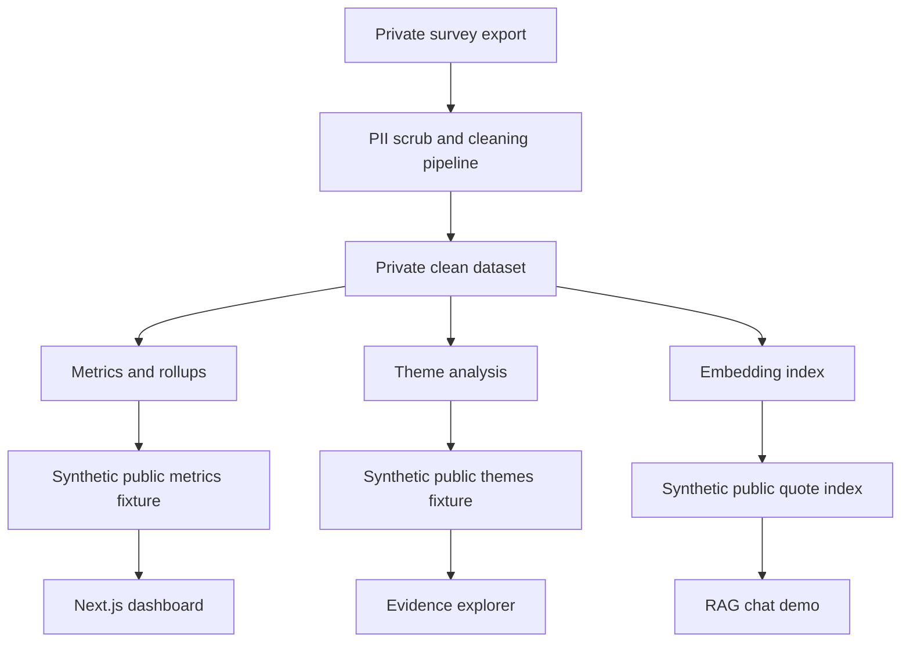

# UA Parking Intelligence Demo

This repository is a public synthetic-data demo of a campus parking analytics platform. It shows the product architecture, dashboard interface, evidence explorer, and retrieval-assisted chat flow without publishing real student responses, real aggregate survey results, or real University of Alabama parking findings.

The original private project was built to turn parking feedback into structured, source-backed analysis for decision-makers. This public version keeps that engineering shape while using fabricated fixture data only.

## Privacy Boundary

- No real student responses are included.
- No real survey aggregates are included.
- No raw Qualtrics export or cleaned CSV is included.
- Public artifacts under `artifacts/` are synthetic fixtures with `metadata.demo_data: true`.
- Screenshots or demos from this repo should be described as synthetic-data examples.

## Demo Features

- Interactive executive dashboard powered by static JSON artifacts.
- Evidence explorer for synthetic theme clusters and example quote snippets.
- Semantic RAG chat route that retrieves from a synthetic quote index before generating an answer.
- Python ETL scripts showing how raw survey data can be cleaned, aggregated, themed, and indexed in a private environment.
- File-based artifact architecture suitable for reproducible review.

## Architecture



## Tech Stack

| Layer | Technology | Purpose |
|-------|------------|---------|
| Frontend | Next.js, React | App Router dashboard and API routes |
| Styling | Tailwind CSS | Utility-first interface styling |
| Charts | Recharts | Dashboard visualizations |
| ETL | Python, pandas | Data cleaning and artifact generation |
| AI | Gemini APIs | Private theme analysis, embedding retrieval, and chat generation |
| Storage | JSON artifacts | Reviewable dashboard inputs |

## Quick Start

```bash
npm install
cp .env.example .env.local
# Add GEMINI_API_KEY if you want to test the chat endpoint.
npm run dev -- --hostname 127.0.0.1 --port 3001
```

Use a non-3000 port if another local project is already using port 3000.

## Artifact Files

The committed files in `artifacts/` are demo fixtures:

- `metrics.json`: synthetic dashboard aggregates.
- `themes.json`: synthetic theme summaries and example quotes.
- `embeddings_index.json`: synthetic quote documents with deterministic fake embeddings.
- `model_insights.json`: synthetic model-insight metrics for UI compatibility.

Private production artifacts should not be committed to this public repo.

## Data Governance

The private workflow treats raw survey exports and cleaned CSV files as sensitive. Public demos should use only synthetic data, and any future screenshots, videos, or hosted builds should be generated from the synthetic fixtures in this repository.

## Author

Built by Karthik Gaur. Public demo prepared with synthetic data for portfolio review.
