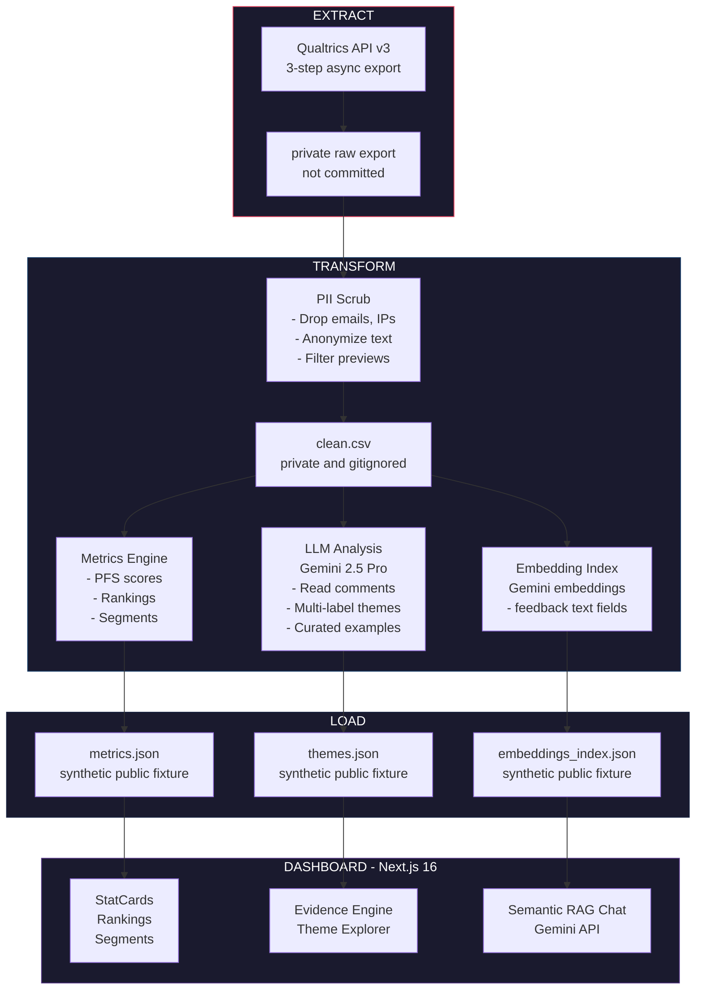

# UA Parking Intelligence Platform

UA Parking Intelligence Platform is a full-stack analytics and retrieval system that turns student parking complaints into a structured dataset and evidence-backed recommendations for university administration. It was built by Karthik Gaur as SGA Treasurer at the University of Alabama in 2025-2026, and became the first comprehensive data-led case SGA brought to UA administration on parking. The survey reached nearly 1.8k students, roughly 10% of UA's undergraduate parking permit holders. Administration had received years of parking complaints but no structured data; this platform produced the analysis they did not have. Findings were presented to UA Parking in April 2026.

This public repository is a synthetic-data demo: it preserves the product architecture and interface while excluding real student responses, exact private aggregate results, and real quotes. The public demo dataset contains 420 fabricated example records. Dashboard numbers below come from the synthetic fixture files committed in `artifacts/`, not from the private survey.

---

## Key Findings

Synthetic demo results:

- 59.9% of example records marked a delayed-or-skipped-class outcome.
- 69.4% rated parking as difficult or very difficult.
- The top ranked demo challenge is limited parking availability, followed by long walks from assigned lots and permit value concerns.
- 56.0% (214/382) would consider improved transit connections in the synthetic scenario.

In the private workflow, Gemini 2.5 Pro performs thematic analysis over free-text responses to identify themes and curate representative examples. Each comment can then be tagged with a primary theme using Gemini 2.5 Flash for segment breakdowns. In this public repository, `themes.json` contains synthetic examples only.

| Theme | Count | % |
|-------|-------|---|
| Parking Availability | 176 | 41.9% |
| Lot Distance | 143 | 34.0% |
| Permit Value | 112 | 26.7% |
| Wayfinding | 84 | 20.0% |
| Transit Connections | 72 | 17.1% |
| Accessibility And Safety | 49 | 11.7% |

Percentages exceed 100% because comments can relate to multiple themes.

---

## Architecture



---

## Semantic RAG Chat

The chat endpoint uses semantic retrieval over an embedded quote corpus rather than keyword matching over curated theme quotes.

- `scripts/build_embeddings_index.py` is the private workflow for building a real quote index from `data/clean.csv`.
- The public demo commits a synthetic `artifacts/embeddings_index.json` built from Gemini embeddings over synthetic text.
- The demo index contains 24 synthetic quote documents.
- Each document stores `id`, `row_id`, `source_column`, `text`, and `embedding`.
- The index metadata records `model: models/gemini-embedding-001` and 768-dimensional vectors.
- `/api/chat` embeds the user query with `models/gemini-embedding-001`.
- It cosine-ranks embedded quote documents and sends the top 8 examples to Gemini generation.
- `themes.json` is still loaded for high-level theme counts in the generation prompt.

The previous prototype searched curated quotes from `themes.json` using literal word overlap. The current system retrieves by vector similarity across the embedded quote corpus.

---

## Tech Stack

| Layer | Technology | Purpose |
|-------|------------|---------|
| Frontend | Next.js 16 + React 19 | App Router, Server Components |
| Styling | Tailwind CSS | Utility-first styling, dark theme |
| Charts | Recharts | Interactive data visualization |
| ETL Pipeline | Python 3.10+ | Extract, transform, load |
| Data Source | Qualtrics API v3 | 3-step async export: create, poll, download |
| AI/LLM | `gemini-2.5-pro` (thematic analysis), `gemini-2.5-flash` (theme tagging), `gemini-2.0-flash-001` (chat generation), `models/gemini-embedding-001` (semantic retrieval) | LLM analysis, retrieval, and chat |
| Storage | File-based JSON artifacts | Version-controlled dashboard inputs |

---

## Quick Start

### Prerequisites

- Node.js 20.9+
- Python 3.10+
- [Gemini API key](https://aistudio.google.com/apikey)

### Installation

```bash
# Clone and install
git clone https://github.com/Karthikgaur8/ua-parking.git
cd ua-parking
npm install
pip install -r requirements.txt

# Configure environment
cp .env.example .env.local
# Add your GEMINI_API_KEY to .env.local if testing chat

# Start development server
npm run dev -- --hostname 127.0.0.1 --port 3001
```

Use a non-3000 port if another local project is already using port 3000.

### Run the Private Pipeline

These commands are included to show the private workflow. Do not run them with real student data in the public repo unless you intend to keep the outputs private.

```bash
# Full refresh via Qualtrics API:
python scripts/refresh_data.py --fetch

# This runs all steps automatically:
#   0. Fetches latest responses from Qualtrics API  -> data/raw/survey_api.csv
#   1. Cleans data (PII removal, anonymization)     -> data/clean.csv
#   2. Builds metrics & rollups                     -> artifacts/metrics.json
#   3. LLM thematic analysis (Gemini 2.5 Pro)       -> artifacts/themes.json

# Build semantic chat retrieval index:
python scripts/build_embeddings_index.py

# Quick refresh (API fetch + skip AI theme re-clustering):
python scripts/refresh_data.py --fetch --skip-themes

# Manual refresh (from local XLSX export):
python scripts/refresh_data.py --input data/raw/survey.xlsx

# Fetch-only (just download, don't process):
python scripts/fetch_qualtrics_api.py
```

---

## Privacy & Governance

- Public demo data: committed artifacts are synthetic fixtures with `metadata.demo_data: true`.
- PII removal: private pipeline scripts drop emails, IPs, geolocation, and direct identifiers before processing.
- Anonymized examples: displayed text should pass through the cleaning pipeline before it is used in private artifacts.
- Source-backed AI: chat responses are generated from retrieved quote documents.
- Audit trail: dashboard inputs are version-controlled JSON artifacts.
- Raw exports and generated clean CSV files are ignored by Git: `data/raw/` and `data/clean.csv`.

---

## Project Structure

```text
ua-parking/
├── src/
│   ├── app/
│   │   ├── page.tsx              # Executive dashboard
│   │   ├── chat/page.tsx         # Semantic RAG chat interface
│   │   ├── evidence/page.tsx     # Evidence Engine (theme explorer)
│   │   ├── models/page.tsx       # Synthetic model-insight view
│   │   └── api/
│   │       ├── chat/route.ts     # Semantic RAG Chat API (Gemini)
│   │       └── evidence/route.ts # Evidence API (cache-invalidated)
│   ├── components/
│   │   ├── StatCard.tsx          # Animated metric cards
│   │   ├── RankingsChart.tsx     # Weighted priority visualization
│   │   ├── SegmentChart.tsx      # Cross-tab breakdown
│   │   ├── DistributionPie.tsx   # Category distributions
│   │   ├── ChatInterface.tsx     # AI chat component
│   │   └── ThemeExplorer.tsx     # Interactive theme browser
│   └── lib/
│       └── data.ts               # Data loading utilities
├── scripts/
│   ├── refresh_data.py           # One-command pipeline orchestrator
│   ├── fetch_qualtrics_api.py    # Qualtrics API 3-step async export
│   ├── load_qualtrics.py         # PII removal + anonymization (CSV/XLSX)
│   ├── build_rollups.py          # Metrics with n/N format
│   ├── build_themes_llm.py       # LLM thematic analysis (Gemini 2.5 Pro)
│   ├── build_embeddings_index.py      # Private semantic chat embedding index
│   ├── build_demo_embeddings_index.py # Public synthetic embedding refresh
│   └── build_themes.py           # Legacy: K-Means clustering (deprecated)
├── artifacts/
│   ├── metrics.json              # Synthetic public dashboard fixture
│   ├── themes.json               # Synthetic public theme fixture
│   ├── model_insights.json       # Synthetic public model fixture
│   └── embeddings_index.json     # Synthetic public chat fixture
├── data/
│   ├── clean.csv                 # Private generated data (gitignored)
│   └── raw/                      # Private original files (gitignored)
└── .env.example                  # Environment template
```

---

## Metrics Formulas

### Parking Friction Score (PFS)

Weighted composite score (0-1 scale):

```python
PFS = 0.35 * difficulty_score + 0.35 * minutes_norm + 0.30 * skip_score
```

### Weighted Priority Score

For ranking challenges:

```python
Score = 3 * rank1_count + 2 * rank2_count + 1 * rank3_count
```

---

## Roadmap

- [x] Phase 0: ETL pipeline + PII scrubbing
- [x] Phase 1: Interactive executive dashboard
- [x] Phase 2: AI theme analysis + Evidence Engine
- [x] Phase 3: Qualtrics API live fetch (automated ETL)
- [x] Phase 4: Semantic RAG survey chat
- [x] Public demo: Synthetic artifacts with no real student data

---

## Author

Built by Karthik Gaur, CS + Math at the University of Alabama. [karthikgaur.com](https://karthikgaur.com).

---

## License

MIT License - See [LICENSE](LICENSE) for details.
